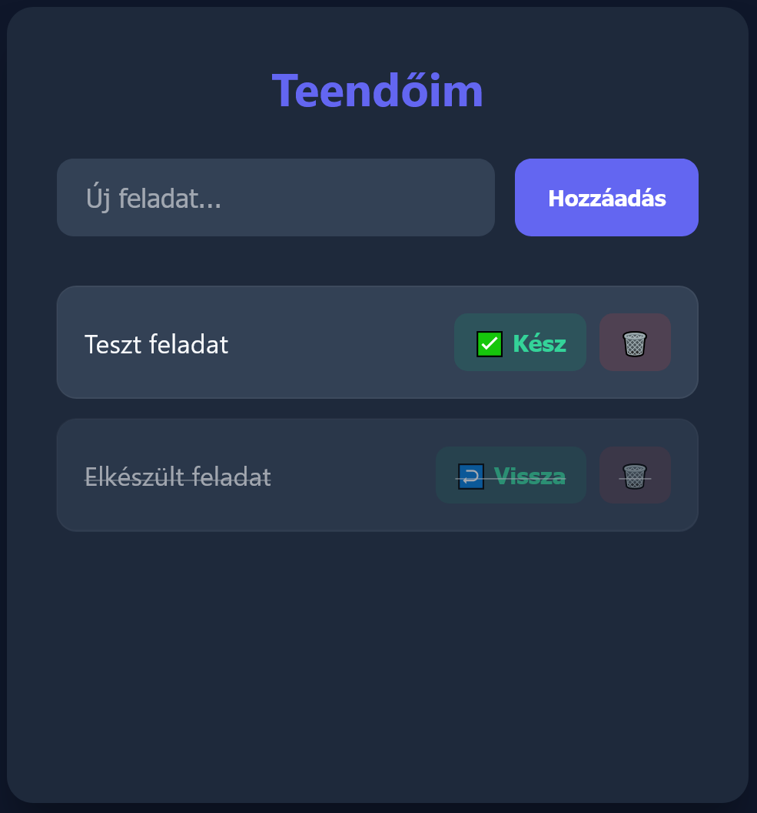

# 📝 Feladatkezelő Webalkalmazás



---

  

Ez egy letisztult, modern **Full-Stack** alkalmazás, amely az alapvető feladatkezelési (CRUD) műveleteket valósítja meg. A projekt az **ExpressJS** backend és a **Vite** frontend technológiákra épül.

  

---

  

### ✍️ Fejlesztők

* Gubik Ádám - **FFSD4N** - adigubik@gmail.com

* Tóth Dávid László - **E6GYUM** - tothdave14@gmail.com

---

### ✨ Főbb Funkciók

  

*  **Listázás:** Teendők valós idejű lekérése a szerverről.

*  **Hozzáadás:** Új feladatok azonnali rögzítése és mentése.

*  **Állapot:** Feladatok késznek jelölése (vizuális áthúzással és állapotmentéssel).

*  **Törlés:** Már nem szükséges elemek végleges eltávolítása a rendszerből.

  

---

  

### 🛠 Technológiai Stack

  

*  **Backend:** Node.js + Express (ESM modulok)

*  **Frontend:** Vite + Vanilla JavaScript

*  **Stílus:** Egyedi CSS3 (Sötét mód, modern kártya-UI)

*  **Adattárolás:** JSON alapú perzisztens fájltárolás (`tasks.json`)

  

---

  

### 📂 Projekt Felépítése

  

*  `backend/`: API végpontok, JSON alapú adattárolás és kiszolgáló logika.

*  `frontend/`: Felhasználói felület, modern stíluslapok (Sötét mód) és API kommunikáció.

  

---

  

### 🚀 Indítás
#### Gyors indítás

```
npm start
```
---

#### 1. Backend indítása

```bash

cd  backend

npm  install

node  index.js

```

#### 2. Frontend indítása

```

cd frontend

npm install

npm run dev

```

----------

### 🤝 Csapatmunka

  

A fejlesztés során a **Git** és a **GitHub** eszközeit használtuk a közös munka koordinálására. A commit history transzparensen tükrözi a moduláris fejlesztési folyamatot és a csapattagok hozzájárulását.

  

----------

  

### 🤖 AI Nyilatkozat (CSS & Refactoring)

  

A projekt fejlesztése során mesterséges intelligenciát vettünk igénybe a vizuális megjelenés és a kódtisztítás támogatására.

  

-  **Modell:** Gemini 3 Flash

-  **Verzió:** Paid tier (Pro)

  

-  **Dátum:** 2026. május 10.

-  **Alkalmazási területek:**

   - **Vizuális stílus (CSS):** Sötét módú, Indigo színvilágú UI generálása és finomítása.
   
   - **Kód-optimalizálás:** Segítség a fájl alapú tárolás és az eseménykezelők refaktorálásában.
   - **Fejlesztői workflow:** Egygombos indítási script (`npm start`) összeállítása `concurrently` használatával.
   - **Tesztelés:** Vitest unit tesztek és **Supertest** integrációs tesztek vázának kialakítása, tesztkörnyezet 		konfigurálása.

-  **Főbb promptok:**

   -  _"Javasolj modern, sötét tónusú CSS színpalettát Indigo kiemelésekkel."_

   -  _"Segíts optimalizálni a frontend API hívásokat és az elemek animációit."_
   -  _"Hogyan tudom egyetlen paranccsal indítani a backendet és a frontendet is?"_
   - _"Írj Vitest teszteket egy Express API végpontjainak tesztelésére szimulált hívásokkal."_

  

----------

  

_Készült: 2026. május – Webalkalmazás-fejlesztés beadandó_
